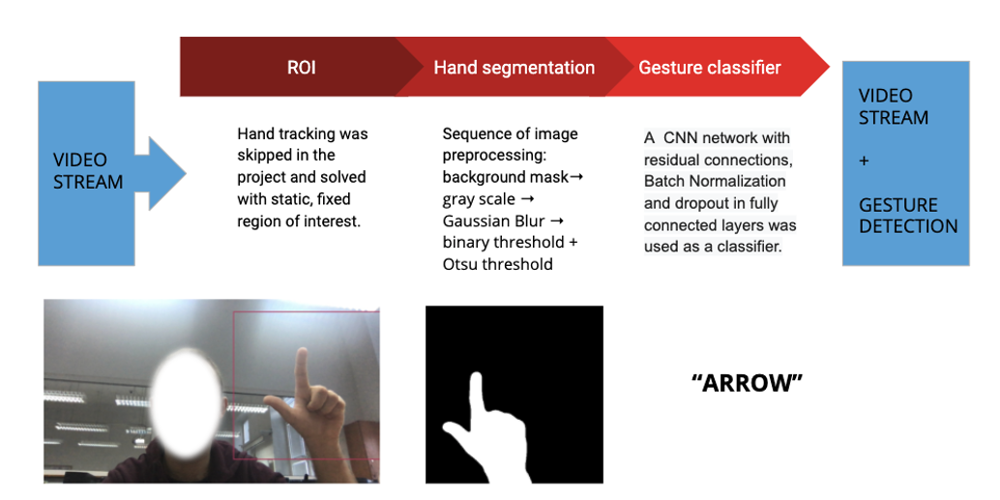

# Real-time recognition of a simple gesture set using a web camera

The aim of the project was to develop a solution that would allow recognizing a set of gestures in a video stream fetched from a laptop webcam. The project was limited to static gestures. A solution based on a neural classifier and image preprocessing  was implemented. A number of hand segmentation methods were also tested. The end result is a desktop application that allows real-time testing of the developed segmentation method and classifier, as well as manual collecting of the  dataset for prior training of models. 

Attached is a report in Polish of our comprehensive research.

Dataset and weights of trained models are not included in this repository. For purposes of testing they can be gatherd manually using provided sprapping mode in the application. 

## App description

As part of the project, an application was prepared that allowed to show detected gestures and collect data on an ongoing basis. In the upper right corner there is the ROI (Region Of Interest) area - this is where the hand with the gesture should appear. The remaining area from the camera is skipped for prediction. The application has two main modes:

1. Data collection mode - allows the user to perform sessions that will acquire photos for later analysis and models' training. The main idea is to get labeled photos, which was achieved through the function keys recording photos of gestures such as:
- arrow -- 'a'
- Ok -- 'o' 
-  Victoria -- 'v' 
- palm -- 'p' 
- three  -- 't' 
- fist -- 'f' 

In addition, the application can apply binarization to the stream with a background mask applied. To take pictures in classic mode, press the '1' key; to take pictures with the mask - press the '8' key.

2. Gesture prediction mode - several prediction models are connected to the application. The numbers given below are the keys that should be pressed to go to the prediction using a given model:

- VGG network with color image on input - '2'
- VGG network with binary image input (naive binarization described in section 4.2) - '3'
- CNN with a color image at the input - '4'
- CNN with a binary image at the input (naive binarization described in section 4.2) - '5'
- VGG network with binary image at the input obtained from the background mask - '6'
- Final CNN with binary image input from the background mask - '7'

## Processing flow

